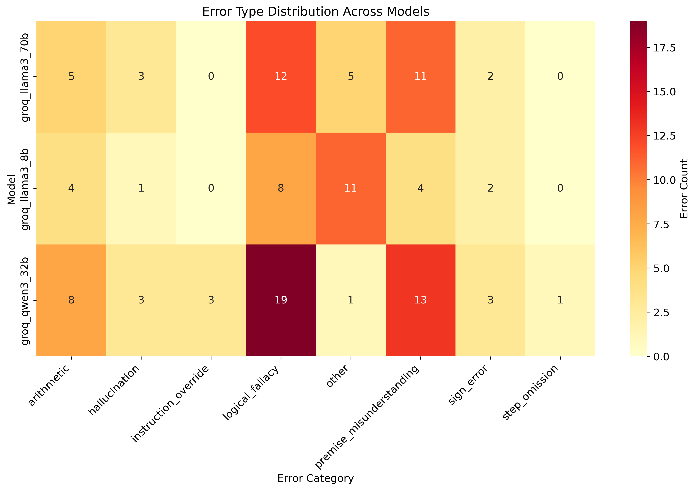
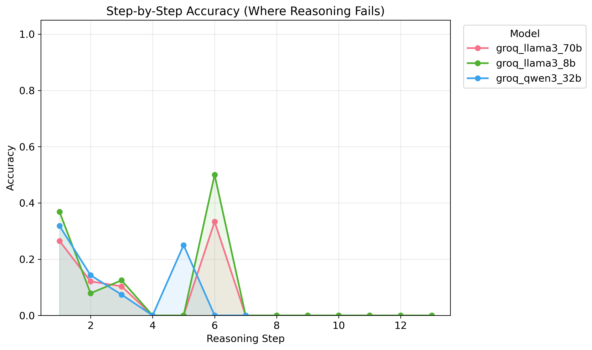
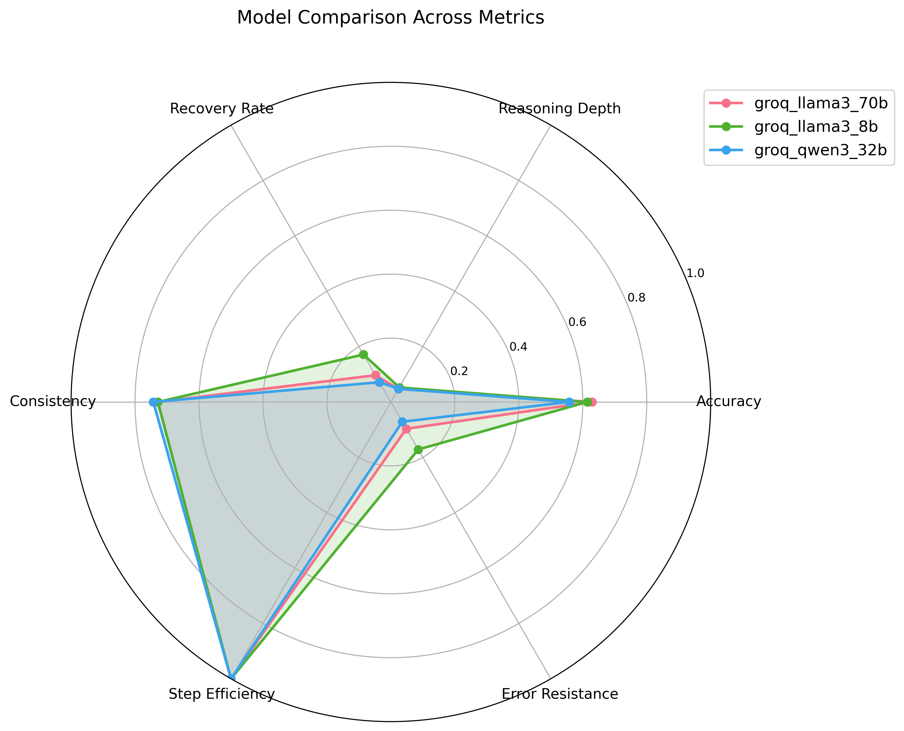

# LLM Reasoning Evaluation Research Report

**Generated:** 2025-12-28 17:32:14

## Abstract

We present a comprehensive evaluation of large language model (LLM) reasoning capabilities using a novel multi-step reasoning benchmark. Our analysis covers 3 models, revealing significant variation in reasoning performance (accuracy range: 55.7% to 62.9%). We introduce novel metrics including reasoning depth (average: 0.49 steps), error recovery rate (11.3%), and error propagation rate (88.7%). Our findings indicate that errors in early reasoning steps frequently cascade through subsequent steps, highlighting the importance of accurate initial reasoning. These findings provide insights for improving LLM reasoning capabilities and inform future research directions in this area.

## Methodology

### Dataset
This evaluation used a dataset of **210** reasoning problems .

### Models Evaluated
- **groq_llama3_70b**: 70 evaluations
- **groq_llama3_8b**: 70 evaluations
- **groq_qwen3_32b**: 70 evaluations

### Metrics
The following metrics were computed:
- **Accuracy**: Fraction of problems with correct final answers
- **Reasoning Depth**: Average number of correct steps before first error
- **Recovery Rate**: Fraction of errors that models self-correct from
- **Consistency Score**: Agreement across multiple samples (0-1)
- **Step Efficiency**: Ratio of optimal to actual reasoning steps
- **Error Propagation Rate**: Fraction of errors that cascade to subsequent steps

## Results

### Overall Performance
| Model | Accuracy | Reasoning Depth | Recovery Rate | Consistency | Step Efficiency |
|-------|----------|-----------------|---------------|-------------|----------------|
| groq_llama3_70b | 62.9% | 0.47 | 9.7% | 72.9% | 100.0% |
| groq_llama3_8b | 61.4% | 0.53 | 17.1% | 72.9% | 100.0% |
| groq_qwen3_32b | 55.7% | 0.48 | 7.1% | 74.3% | 100.0% |

## Key Findings

1. **Model Comparison**: *groq_llama3_70b* achieved the highest accuracy (62.9%), while *groq_qwen3_32b* had the lowest (55.7%).

2. **Error Recovery**: *groq_llama3_8b* showed the best error recovery capability (17.1%).

## Statistical Analysis

### Pairwise Model Comparisons
| Comparison | Accuracy Diff | Effect Size (Cohen's h) | 95% CI | p-value |
|------------|---------------|-------------------------|--------|--------|
| groq_llama3_70b vs groq_llama3_8b | 1.4% | 0.029 | [-14.6%, 17.5%] | 1.0000 |
| groq_llama3_70b vs groq_qwen3_32b | 7.1% | 0.146 | [-9.1%, 23.4%] | 0.4914 |
| groq_llama3_8b vs groq_qwen3_32b | 5.7% | 0.116 | [-10.6%, 22.0%] | 0.6068 |

*Effect size interpretation: |h| < 0.2 = small, 0.2-0.8 = medium, > 0.8 = large*

## Conclusion

This evaluation assessed 3 model(s) on multi-step reasoning tasks. The average accuracy across models was **60.0%**, with an average reasoning depth of **0.49** steps before encountering errors.

Models demonstrated some ability to recover from errors, with an average recovery rate of **11.3%**. 
### Recommendations
Based on these findings:
1. Focus on improving early-step accuracy to prevent error cascades
2. Investigate training approaches that enhance error recovery
3. Consider difficulty-aware prompting strategies

## Figures

### Error Heatmap

### Step Accuracy Curves

### Model Comparison Radar

